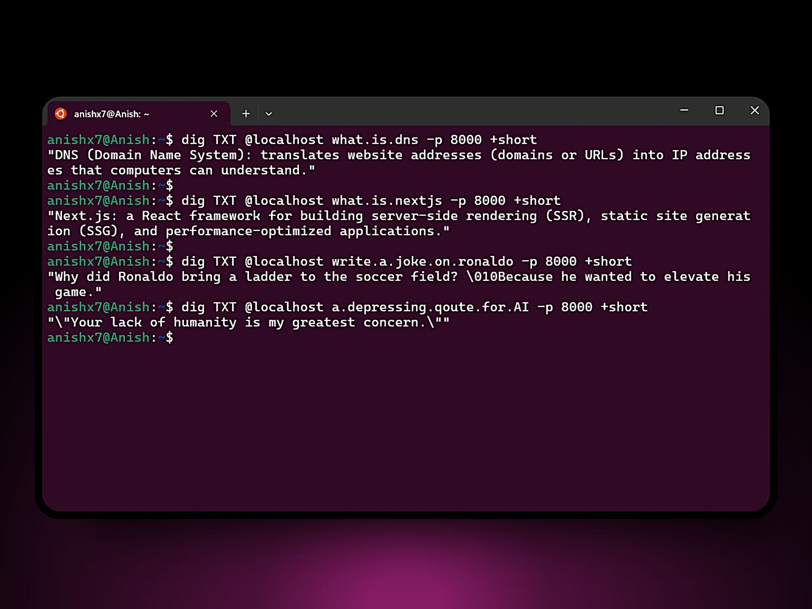
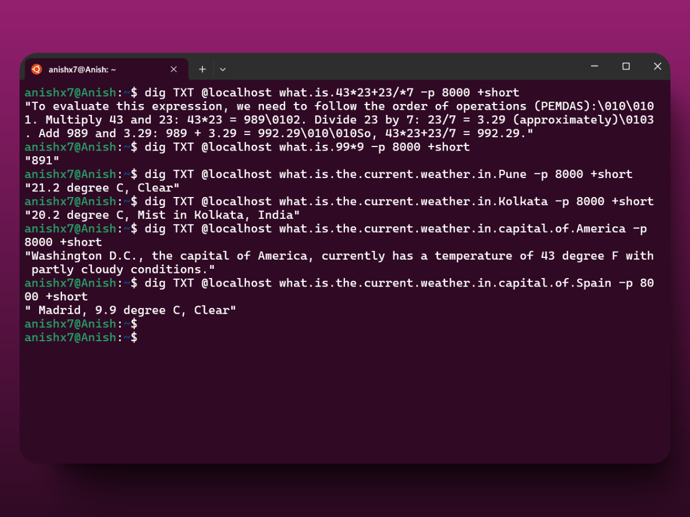

# 🌐 AI-Powered DNS Server

A smart DNS server leveraging state-of-the-art AI technology.



### Can even do Tool Calling with AI 🤯


Video Demo link : https://www.youtube.com/watch?v=kC-xaDifOt0
- Doing simple math calculations with perfect reasoning
- Getting the current weather with the location based on its reasoning
- Getting the current time with the correct timezone

## 🚀 Tech Stack

- 🎯 **Bun** - Modern JavaScript runtime and package manager
- 📝 **TypeScript** - Enhanced code quality with static typing
- 🧠 **Llama 3.3 70b** - Ultra-fast AI model (staggering speed of ~2200k tokens/sec) via Cerebras Inference
- 🔄 **Denamed** - Robust DNS server implementation

## 🛠️ Setup & Installation

1. Install dependencies:

```bash
bun install
```

2. Get your API key from [Cerebras AI Inference](https://cloud.cerebras.ai/)
3. Create `.env` file and add your API key

## 🚦 Running the Server

Start the development server:

```bash
bun run dev
```

## Using the DNS Server

use `dig` command to query the DNS server:

```bash
dig TXT @localhost what.is.AI -p 8000 +short
```

> Note: Ask the question without spaces in between, use dots to separate words

---

Made with ❤️ by [Anish](https://anish7.me)
